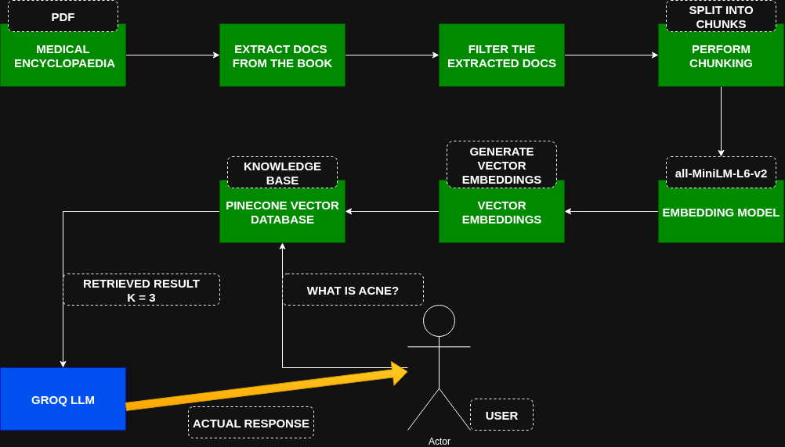

# AN END TO END RAG-BASED MEDICAL CHATBOT (GEN AI)
# How to run the project (Linux Machine)
### STEPS:

Clone the repository

```bash
Project repo: https://github.com/Kibs-Neville/medical-chatbot.git
```

### STEP 1 - Create a Python virtual environment after opening the project folder; activate the environment

```bash
python3 -m venv .venv
```

```bash
source .venv/bin/activate
```

### STEP 2 - Install the requirements

- We first run this manually to avoid installing gpu bloat
  
```bash
python3 -m pip install torch --index-url https://download.pytorch.org/whl/cpu
```
- Then this

```bash
python3 -m pip install -r requirements.txt
```

### STEP 3 - Create a .env file in the root directory and add your Pinecone & Groq API Keys as follows

```bash
PINECONE_API_KEY = "xxxxxxxxxxxxx"
GROQ_API_KEY = "xxxxxxxxxxxxxxx"
```

### STEP 4 - Run this to create a Pinecone index and load it with vector embeddings (Creating the knowledge base)

```bash
python3 store_index.py
```

### STEP 5 - Run the Flask server and access the app through the link provided

```bash
python3 app.py
```
---

# MEDIBOT ARCHITECTURE
# The figure below represents the Medibot project architecture

